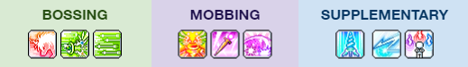

# Boost Node Search

Boost Node icons are basically three skill icons spliced together. This webpage works by first finding the boost node icons and then start matching the pixels of each one-third section of the icon with the skill icons for that class to find the three skills that the node boosts. 

Select the class and then add images of the V-Matrix **Disassemble Nodes** page by either:

1. Screenshot Win+Shift+S then paste Ctrl+V on the webpage
2. Drag and drop multiple PNG files on the webpage

The searches use **assets/trinode_mask.png** which does not account for the boost node being **Locked**, so make sure to unlock the boost nodes before taking the screenshot then **Relock** them.

After finding the list of boost nodes, a brute force algorithm is run to find up to 10 sets of trinodes after the user selects which nodes to search and how many node slots will be used. The sets will contain boost nodes with different skills in the first slot and each skill appears at least twice. Due to the algorithm chosen, the sets shown may be very redundant.

If having **ideal trinode** pairs are preferred, search for one trio at a time.

## Demo

A demo is available by typing 'demo' on the page. The demo loads a Mercedes class's boost nodes after opening around 300 Nodestones (plus a few hundred previously compressed nodes in page/image 1).

An example of an ideal node setup is shown below taken from [The Comprehensive Guide to Mercedes](https://docs.google.com/document/d/1Sz5rdODR3cgaw3WcfjjVN_OBQV2298vc_kVyFOfdh_8/edit#).
(The character in the demo is still missing one of the bossing trinodes :sad: but through the power of photoshop, this character now has all of the ideal trinodes)

## Updating Skill Icons

Class skill icons will have to be updated whenever they change in game - usually every major update.

1. New classes are added via a PNG image using the class name in **assets/class-portrait**.

2. Class skill icons are added in **assets/classes/\<class-name>**.

3. Take a screenshot of all the class skills in the V-Matrix **Nodecrafting** menu then paste and save in **assets/a.png** using MS Paint. (Need to clean up scripts and files). 

4. Run the following Python script to generate skill icons inside the class's skill icon folder, then manually update the file names with the skill names. Alternatively, manually create the 32 x 32 pixel PNG files using the skill icons taken in step 3. This is important because some class's boost node skill icons have a different brightness than the ones in the regular skill tab for some reason.
   > python p.py \<class-name>

5. Finally, run the following script to create **out.json** which is a JSON file of the folder structure of **assets**. Again, manually updating the file works as well.
   > node file.js

Initial class assets taken from [Grandis Library](https://github.com/ikasuu/grandislibrary) and modified to match in-game icons (completed all 49 class's 5th job advancement \0/).
